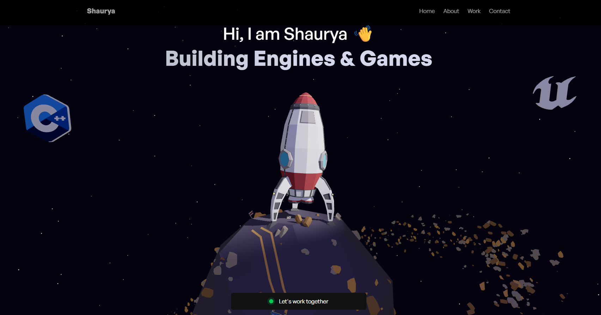
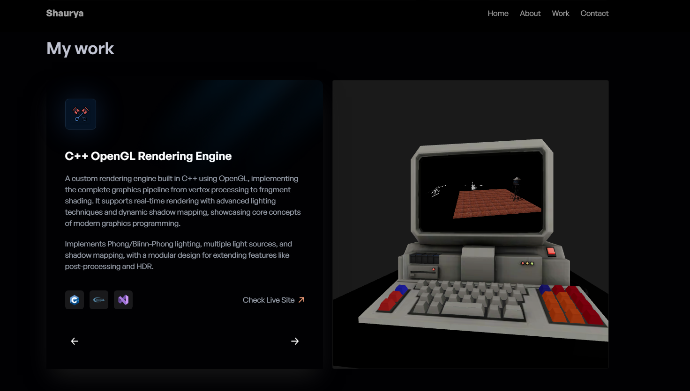

# 🌐 Personal Portfolio Website  

🚀 A modern interactive developer portfolio built using **React.js** and **Three.js**, showcasing my projects in graphics programming, game development, and web technologies.

## 🚀 Tech Stack of Portfolio Website

* **Build Tool:** Vite
* **Styling:** Tailwind CSS
* **Version Control:** Git & GitHub
* **Frontend:** React.js
* **3D Graphics:** Three.js

## ✨ Features

* Interactive 3D elements using Three.js
* Smooth animations and modern UI
* Responsive design for different screen sizes
* Project showcase section
* Contact section
* Fast performance using Vite

## 📦 Installation & Setup

To run this project locally:

```bash
git clone https://github.com/Shaurya1907/portfolio_website.git

cd portfolio_website

npm install

npm run dev
```

Then open:

```text
http://localhost:5173
```

## 🌍 Live Demo

(Will be added after deployment)

## 📸 Screenshots

### 🏠 Hero Section



### 🧠 Project Section



## 📁 Project Structure

```
portfolio_website/
│── public/
│── src/
│── index.html
│── package.json
│── vite.config.js
│── README.md
```

## 🛠️ Future Improvements

* Add more projects
* Improve animations
* Optimize 3D assets
* Add dark/light mode toggle

## 👨‍💻 Author

**Shaurya Goyal**

GitHub: https://github.com/Shaurya1907

---

⭐ If you like this project, feel free to star the repository!
